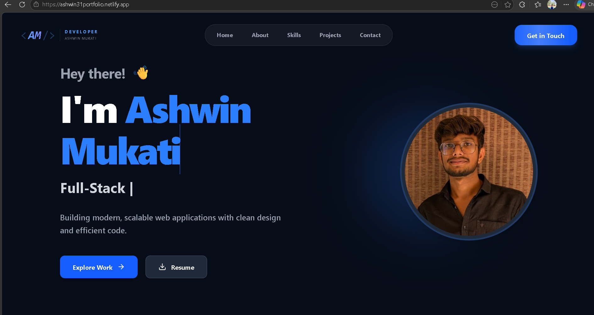
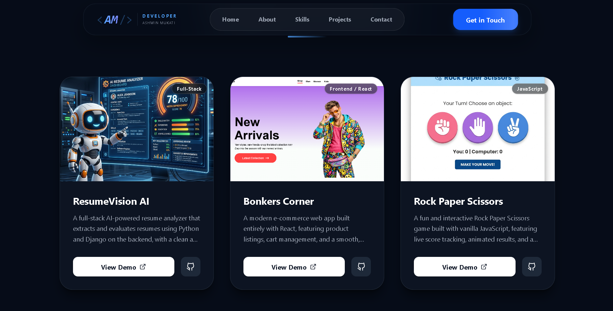
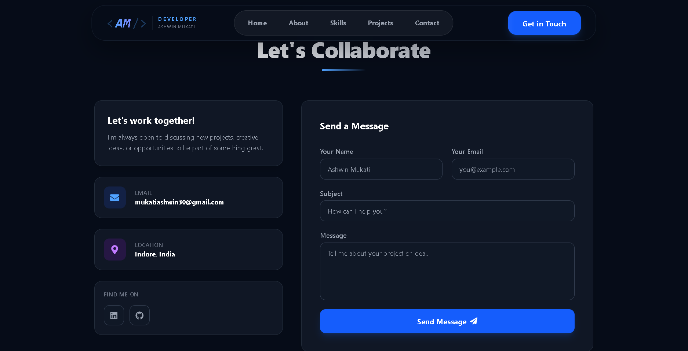

# My Portfolio Website

A full stack personal portfolio website showcasing my projects, skills, and contact information.

🚀 Features
- Responsive modern UI
- Project showcase section
- About me section
- Contact form
- Backend integration
- Database connectivity


🛠 Tech Stack
# Frontend
- HTML
- CSS
- JavaScript
- React
- Bootstrap

# Backend
- Python
- Django

# Database
- SQLite

## 📂 Repo Structure
```bash
frontend/
backend/
```

# Installation

Clone repository:

```bash
git clone https://github.com/iamashwinmukati30/My-Portfolio.git
cd My-Portfolio
```

Backend setup:

```bash
cd backend
pip install -r requirements.txt
python manage.py runserver
```

Frontend setup:

```bash
cd frontend
npm i (for node module)
npm run dev
```
## Screenshots

### Homepage


### Projects


### Contact

## 🌐 Live Demo
https://ashwin31portfolio.netlify.app/

## 📌 Future Improvements
- Blog section
- Resume download
- Better animations
- Email notifications

## 👨‍💻 Author
Ashwin Mukati
B.Tech CSE | Full Stack Developer
